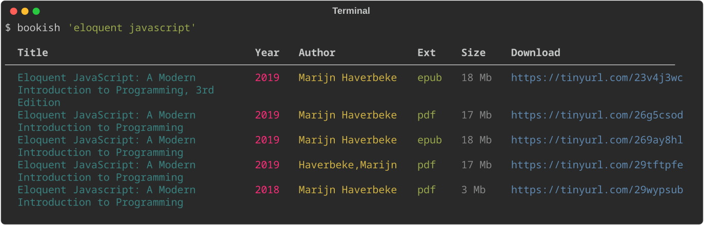

# bookish

`bookish` is a CLI tool for downloading eBooks.

## Example



## Usage

Requires [Docker](https://docs.docker.com/get-docker/) or [Poetry](https://python-poetry.org).

### Docker

```bash
git clone https://github.com/jgafnea/bookish && cd bookish
docker build -t bookish .

# Using with optional alias:
alias bookish="docker run --rm -it bookish"
bookish "book title"

# Using without alias:
docker run --rm -it bookish "book title"
```

### Poetry

```bash
git clone https://github.com/jgafnea/bookish && cd bookish
poetry install

# Using with optional alias:
alias bookish="poetry run bookish"
bookish "book title"

# Using without alias:
poetry run bookish "book title"
```
